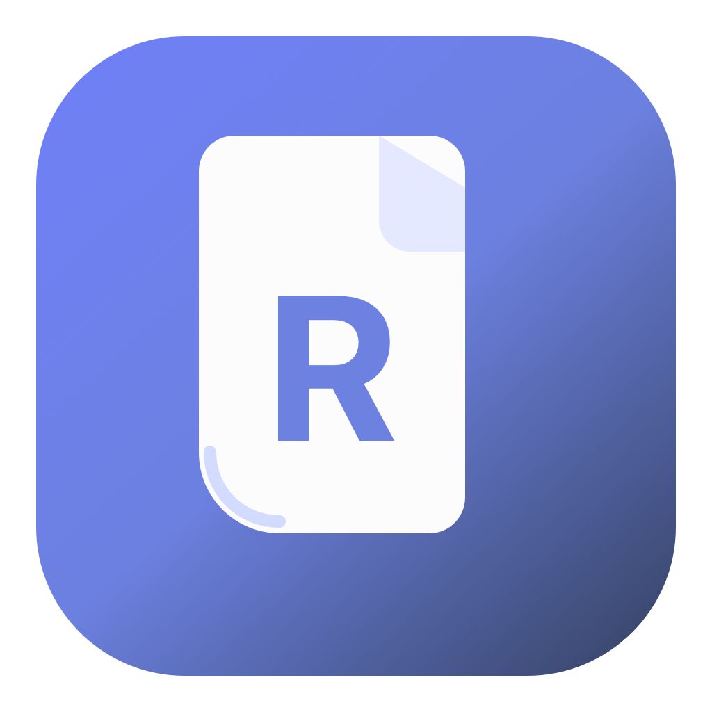
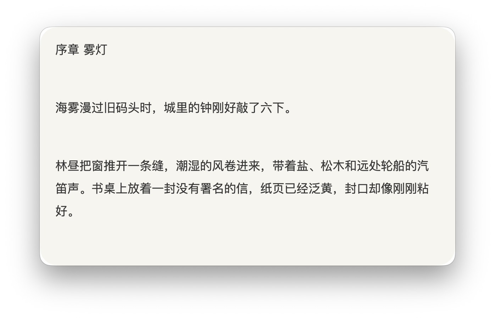
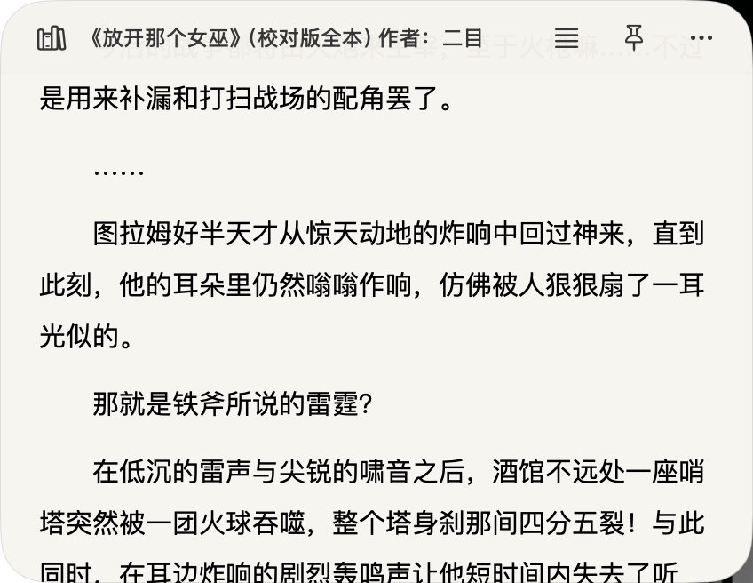
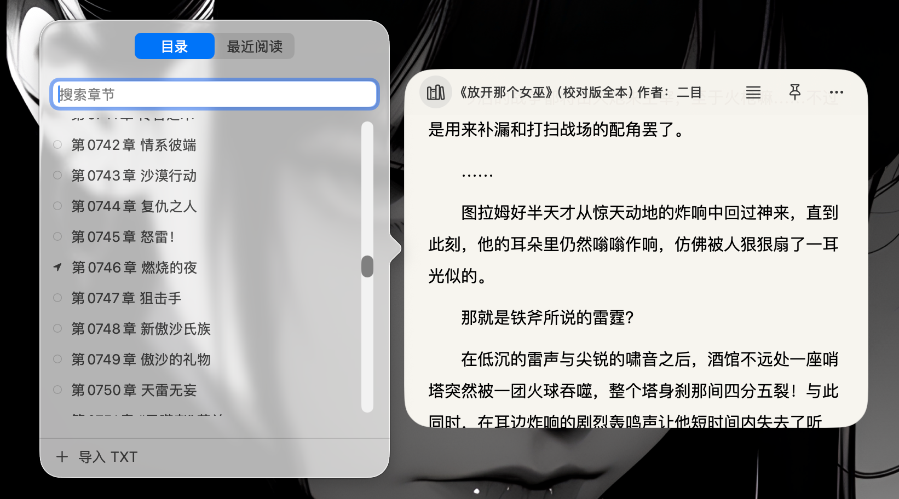
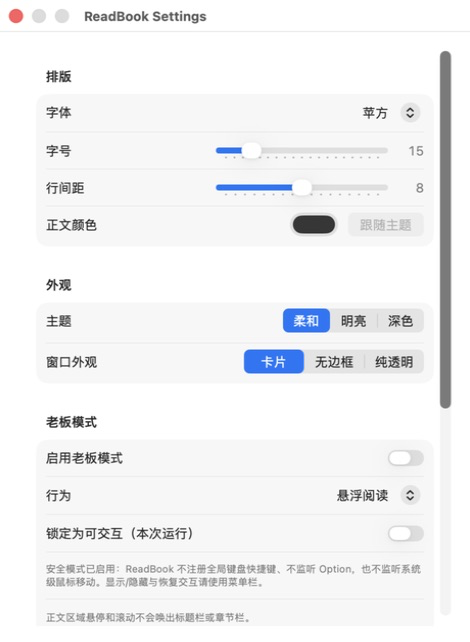

<p align="center">
  
</p>

<h1 align="center">ReadBook</h1>

<p align="center">
  把本地 TXT 小说，放进一个安静的 macOS 小窗口。<br>
  <em>A lightweight, local-first TXT novel reader for macOS.</em>
</p>

<p align="center">
  <a href="https://github.com/coderlife-book/read-book/releases/latest"></a>
  
  
</p>

<p align="center">
  <a href="https://github.com/coderlife-book/read-book/releases/latest"><strong>下载最新版本</strong></a>
  ·
  <a href="#开发运行">本地构建</a>
</p>

<p align="center">
  
</p>

<p align="center"><sub>工具栏离开后自动隐藏，只留下正文。截图内容为原创演示文本。</sub></p>

<p align="center">
  
</p>

<p align="center"><sub>阅读窗口支持本地 TXT、目录切换、分页与滚动阅读。</sub></p>

<p align="center">
  
</p>

<p align="center"><sub>目录面板支持章节搜索、最近阅读和快速导入 TXT。</sub></p>

## 为什么做 ReadBook

大多数阅读器适合管理一整套电子书库，ReadBook 只解决一个更具体的问题：在 Mac 上随手打开一本本地 TXT，安静地读几分钟，然后回到原来的工作。

- **像桌面小组件一样轻**：小窗口、可置顶、位置和尺寸自动恢复。
- **两种阅读方式**：左右分页与上下连续滚动可以随时切换。
- **工具栏不打扰**：默认隐藏，鼠标移动到窗口顶部后出现。
- **进度可靠**：以 UTF-16 offset 保存阅读位置，切模式、改字号或 Resize 后仍能恢复。
- **本地优先**：小说、书库、偏好和进度都保存在 Mac 本地，没有账号和云同步。
- **原生窗口体验**：使用 AppKit/SwiftUI，支持原生拖动、四边与四角 Resize。

## 阅读能力

- 导入本地 `.txt`，并复制到 ReadBook 自己的本地书库
- UTF-8、UTF-16、GB18030/GBK、Big5 解码
- 自动识别常见中文章节标题，支持目录搜索和跳转
- 多本小说与最近阅读
- 分页模式：点击左右区域、方向键或触控板横向翻页
- 连续模式：触控板、鼠标滚轮、方向键或 Page Up/Page Down 滚动
- 苹方、宋体、楷体和系统字体
- 字号、行距与正文颜色调整
- 柔和、明亮、深色三种主题
- 卡片、无边框、纯透明三种窗口外观
- 始终置顶、小组件模式和菜单栏入口
- 老板模式与交互锁定
- 自动检查 GitHub Release 更新，下载安装前由用户确认

<p align="center">
  
</p>

## 安装

1. 前往 [Releases](https://github.com/coderlife-book/read-book/releases/latest) 下载 `ReadBook-macOS.zip`。
2. 解压后将 `ReadBook.app` 移到“应用程序”，或直接在任意本地目录运行。
3. 首次启动后，点击“选择 TXT…”或按 `⌘O` 导入小说。

当前发布包使用 ad-hoc 签名，尚未使用 Apple Developer ID 和 notarization。如果 macOS 阻止首次启动，请在 Finder 中右键 `ReadBook.app`，选择“打开”。

## 常用操作

| 操作 | 方式 |
| --- | --- |
| 导入 TXT | `⌘O` |
| 分页 | `←` / `→`，或点击窗口左右区域 |
| 连续滚动 | 触控板、鼠标滚轮、方向键、Page Up/Page Down |
| 显示工具栏 | 鼠标移动到窗口顶部 |
| 移动窗口 | 拖动顶部区域 |
| 调整窗口 | 拖动四边或四角 |
| 显示或隐藏阅读器 | 菜单栏 ReadBook 图标 |

## 隐私与数据

ReadBook 没有账号体系、网络书库、遥测或云同步。除检查 GitHub Release 更新外，阅读数据不需要离开本机。

导入后的小说保存在：

```text
~/Library/Application Support/ReadBook/
├── library.json
├── Books/
│   └── <UUID>/
│       ├── content.txt
│       └── metadata.json
└── Cache/
```

`content.txt` 在导入阶段统一转换为 UTF-8。每本书的权威阅读位置保存在自己的 `metadata.json` 中；`library.json` 是可以从 `Books/` 重建的书库索引。

## 系统要求

- macOS 26+
- 主要开发与 CI 验证目标：Apple Silicon Mac
- 本地构建需要 Xcode 26+ / Swift 6

## 开发运行

```bash
swift test
swift run ReadBook
```

打包本地 `.app`：

```bash
Scripts/build-app.sh
open dist/ReadBook.app
```

项目使用 Swift Package Manager：

- `ReadBookCore`：模型、存储、TXT 解码、章节解析、分页和阅读会话
- `ReadBook`：SwiftUI/AppKit App、阅读界面、设置和窗口交互

协作、测试、PR 与发布规则见 [AGENTS.md](AGENTS.md)。

## 当前范围

ReadBook 专注于 macOS 本地 TXT 阅读。EPUB、PDF、MOBI、在线抓书、账号、云同步、全文搜索、笔记、划线、TTS、封面管理、iOS 和 WidgetKit 暂不在当前范围内。

## 支持项目

如果 ReadBook 正好解决了你的阅读场景，欢迎点一个 Star。它能帮助更多需要“安静读本地 TXT”的人发现这个项目。
